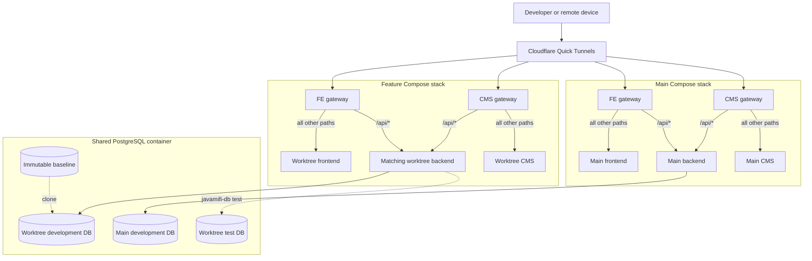

# JavaMifi Local Development

This directory runs JavaMifi's shared PostgreSQL service and any number of
isolated application stacks. A stack can use main checkouts, worktrees, or a
combination of both without changing the main checkout environment files.

- `javamifi-db` owns PostgreSQL and isolated worktree databases.
- `javamifi-localhost` owns FE, CMS, backend, gateways, random ports, generated
  runtime environments, and Cloudflare Quick Tunnels.
- `compose.yaml` is the fixed shared database project.
- `apps.compose.yaml` is instantiated once per unique application stack.
- `architecture.mmd` contains the standalone Mermaid source for the graph below.

Do not run `docker compose down` against the database project while another
worktree may be active.

## First-time setup

Keep this repository beside the three application repositories. The CLI uses
this sibling layout to find the main checkouts and their worktrees:

```text
javamifi/
|-- javamifi-local/
|-- javamifi.com-be/
|-- javamifi.com-fe/
`-- cms.javamifi.com/
```

Install Docker with Compose v2, Node.js 20, npm, Git, curl, and gzip. Then install
the repository CLIs:

```bash
cd javamifi-local
./install
command -v javamifi-db javamifi-localhost
```

`install` creates symlinks in `~/.local/bin`; it does not copy the scripts or
modify shell profiles. Set `JAVAMIFI_BIN_DIR` to install elsewhere. If the
reported directory is not on `PATH`, add the printed export to your shell
profile. Both scripts can also be run directly from this repository without
installing them.

Database snapshots and PostgreSQL storage are intentionally excluded from Git
because they are large and may contain sensitive data. Obtain an approved
gzip-compressed SQL snapshot through the team's secure channel, then initialize
the baseline from the backend checkout:

```bash
cd ../javamifi.com-be
javamifi-db baseline restore /path/to/snapshot.gz javamifi_staging_YYYYMMDD
javamifi-db setup
```

The restore command imports the snapshot into the shared local PostgreSQL
container and installs an immutable baseline for current and future worktrees.
It refuses to overwrite an existing snapshot database.

## Architecture



Each UI has a same-origin Nginx gateway. Requests under `/api/*` go to that
stack's backend; every other path goes to FE or CMS. This is required because
the backend's strict authentication cookies do not work across separate FE and
API tunnel domains.

## Stack Isolation

Every unique selection of checkout paths produces:

- a stable stack ID;
- an independent Compose project and Docker network;
- persistent random host ports in dedicated ranges;
- generated env files under `.runtime/<stack-id>/`;
- one development database per backend worktree;
- one clean test database per backend worktree;
- one temporary Quick Tunnel URL for each selected UI.

This permits main FE+BE and worktree FE+BE to run together. CMS can be included
in either stack without sharing application containers or ports.

The main FE, CMS, and backend `.env` files are read-only baseline inputs.
`javamifi-localhost` copies them into private runtime state and applies only
runtime-specific overrides such as API URLs, CORS origins, ports, database host,
site URLs, and development Turnstile credentials. It derives the selected
backend database from the checkout's canonical path through `javamifi-db`
instead of trusting a copied or stale `DATABASE_URL`.

## Start stacks

Run all three main checkouts:

```bash
./javamifi-localhost up --all --name main
```

Run a frontend and backend worktree together:

```bash
./javamifi-localhost up \
  --fe ../javamifi.com-fe-worktrees/feature-example \
  --be ../javamifi.com-be-worktrees/feature-example \
  --name feature-example
```

Run a CMS worktree with the main backend:

```bash
./javamifi-localhost up \
  --cms ../cms.javamifi.com-worktrees/feature-example \
  --be ../javamifi.com-be \
  --name feature-example
```

When invoked from a repository or worktree without explicit paths, the CLI
selects that checkout. It finds a backend worktree with the same branch when
available and otherwise uses the main backend checkout. A backend invocation
similarly selects the matching frontend or main frontend.

Common automatic selections:

| Invocation location | Application stack |
| --- | --- |
| FE worktree | Selected FE plus matching backend worktree, or main backend |
| CMS worktree | Selected CMS plus matching backend worktree, or main backend |
| Backend worktree | Selected backend plus matching frontend worktree, or main FE |
| `javamifi-local` | All three main checkouts |

Development databases remain exact clones of `javamifi_worktree_baseline`.
Because the current Prisma schema has destructive drift from that staging
snapshot, setup synchronizes only the clean test database. Schema-changing work
remains blocked until migration history is reconciled.

The printed FE and CMS URLs are same-origin gateways: `/api/*` reaches that
stack's backend and all other paths reach the selected Next.js app. This keeps
strict authentication cookies working through Cloudflare.

Frontend localhost stacks use Cloudflare's official always-pass Turnstile test
site key and paired backend secret. Production credentials remain untouched in
the main env baselines.

## Database Lifecycle

Run database commands from a backend worktree:

```bash
javamifi-db setup    # clone development data, prepare test DB, env, Prisma, seed
javamifi-db ensure   # create the path-specific development clone if missing
javamifi-db status   # show database names, baseline, port, and container state
javamifi-db test     # guarded tests against this worktree's test database
javamifi-db reset    # recreate both databases after relevant repository changes
javamifi-db drop     # drop both databases before worktree removal
javamifi-db baseline restore <archive.gz> <javamifi_staging_YYYYMMDD>
```

Never run backend tests directly with `npm test`; use `javamifi-db test` so the
guard verifies the isolated test database first. Never connect application code
to `javamifi_worktree_baseline` directly.

## Inspect and stop

```bash
./javamifi-localhost status
./javamifi-localhost status <stack-id>
./javamifi-localhost logs <stack-id> [service]
./javamifi-localhost down <stack-id>
./javamifi-localhost down -all
```

Stopping an application stack does not stop PostgreSQL or drop its worktree
databases. Use `down -all` to stop every application stack managed by this
checkout. Quick Tunnel URLs are public, temporary, limited to 200 concurrent
requests, do not support SSE, and are for development only.

Running `up` again recreates Quick Tunnels, so use the newly printed URLs. Local
ports and the stack ID remain stable for that checkout combination.

## Ship Integration

Repository-local `javamifi-ship` and `localhost` skills extend the global ship
workflow:

1. Create the repository worktree and shared feature branch.
2. Copy environment baselines into private runtime state.
3. Prepare the backend worktree database when backend is involved.
4. Implement and validate repository changes.
5. Commit, push, and open the PR or MR.
6. Start one integrated stack and verify UI plus `/api/v1/health` connectivity.
7. Report the stack ID, selected paths, and current Quick Tunnel URLs.

For multi-ship, repository workers do not launch partial stacks. The coordinator
waits until all selected PRs are open and starts one combined stack. FE-only and
CMS-only shipping still includes a backend, using the matching worktree when it
exists and main otherwise.

## Troubleshooting

### Turnstile cannot connect

Do not use production Turnstile credentials with Quick Tunnel hostnames. The
runtime injects Cloudflare's official always-pass development pair into the
generated FE and backend env files. Re-run `up` and use the newly printed URL if
an older stack predates this behavior.

### Tunnel URL does not resolve

Quick Tunnels have no uptime guarantee. Re-run `up`; the CLI forces tunnel
recreation, waits for a registered connection, and prints replacement URLs.
The tunnel is pinned to HTTP/2 because some local networks block QUIC port 7844.

### Backend is unhealthy in Docker

The backend uses the full `node:20-bookworm` image because Prisma requires
OpenSSL 3. Inspect it with:

```bash
./javamifi-localhost logs <stack-id> backend
```

### Worktree setup reports Prisma drift

Development clones intentionally remain identical to the baseline. Only the
clean test database is pushed to the current Prisma schema. Do not force-reset,
truncate baseline data, or create a migration until staging and migration
history have been reconciled.

Replacing the immutable baseline does not rewrite existing development clones.
Use `javamifi-db reset` from a backend worktree when you explicitly want to
discard its local development data and re-clone every baseline row.

`setup` and `ensure` also synchronize every restored serial/identity sequence to
the maximum value already present in its table. Snapshot imports can contain
explicit IDs while leaving sequences behind; without this step, inserts such as
`refresh_tokens` can fail with a unique constraint on `id`.

### Unique constraint failed on an auto-increment `id`

Run `javamifi-db ensure` from the affected backend checkout. It keeps every row
and synchronizes restored PostgreSQL sequences in place. Use `reset` only when
you also intend to discard the development database and re-clone the baseline.

### Stop versus cleanup

`javamifi-localhost down <stack-id>` removes only application containers and
their network. It leaves generated runtime state and databases available. During
explicit worktree cleanup, run `javamifi-db drop` before removing the backend
worktree.
